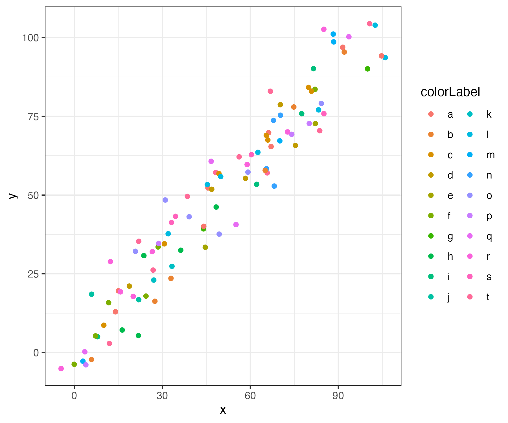
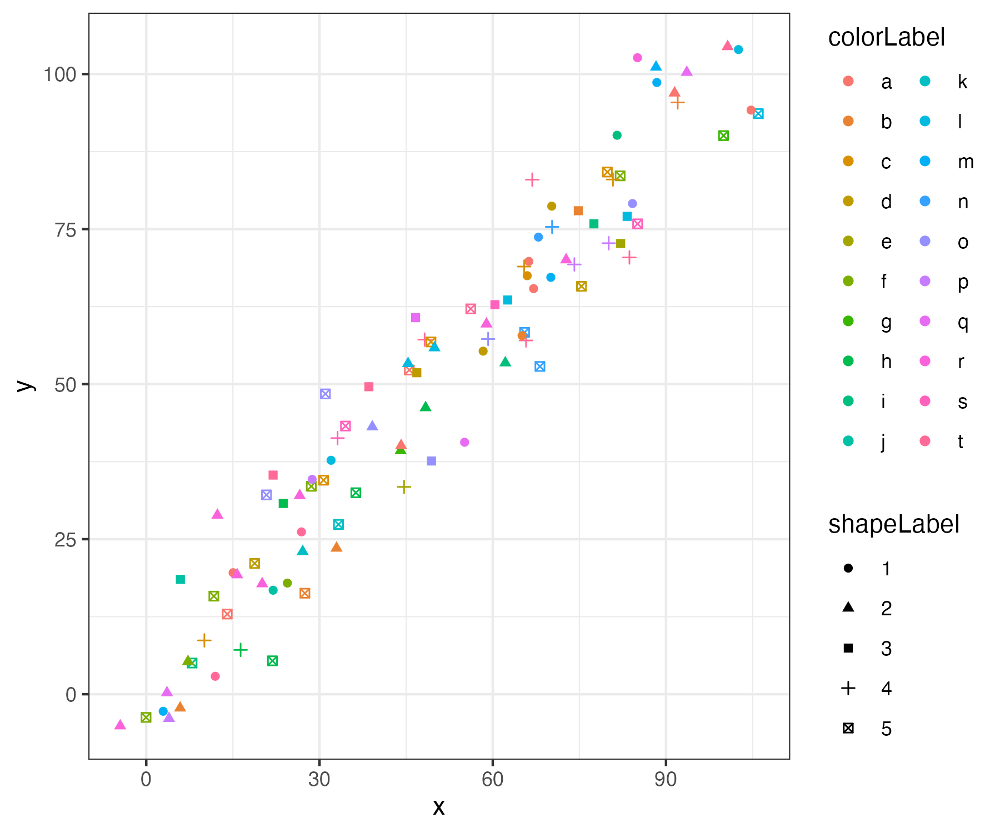
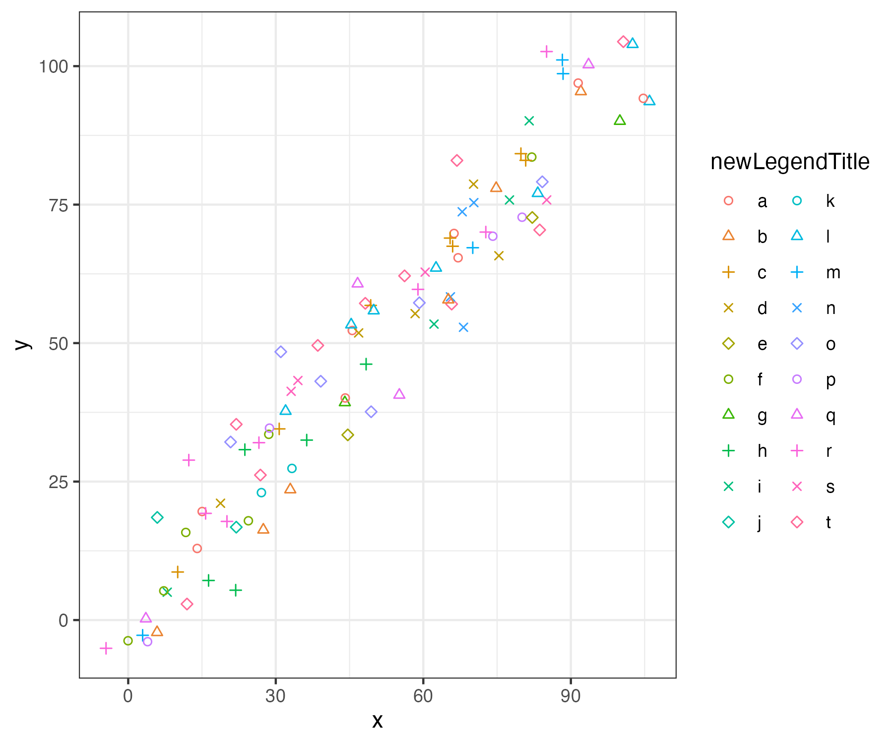

# ggunileg


I often face the problem of wanting to visually distinguish data with dozens of distinct groups, in which case color scales
often become uninformative.

```
some_data <- data.frame(x = 1:100 + runif(n = 100, min = -10, max = 10), y = 1:100 + runif(n = 100, min = -10, max = 10), colorLabel = sample(letters[1:20], size = 100, replace = T))
```some_data <- data.frame(x = 1:100 + runif(n = 100, min = -10, max = 10), y = 1:100 + runif(n = 100, min = -10, max = 10), colorLabel = sample(letters[1:20], size = 100, replace = T))

```
bad_plot <- ggplot(data = some_data, aes(x = x, y = y, color = colorLabel)) +
  geom_point() +
  theme_bw() +
  guides(color = guide_legend(ncol = 2))
bad_plot
```


One potential solution is to combine color- and shape scales, but this is not really helpful out of the
because the legends are not combined by default, so mapping invidiual points to their
color- and shape value by eye is cumbersome at best.

```
some_data$shapeLabel <- as.factor(sample(1:5, size = dim(some_data)[1], replace = TRUE))
still_bad_plot <- ggplot(data = some_data, aes(x = x, y = y, color = colorLabel, shape = shapeLabel)) +
  geom_point() +
  theme_bw() +
  guides(color = guide_legend(ncol = 2))
still_bad_plot
```



To fix this I offer the scale_color_highres function as a convenience function.
The number of distinct shape levels can be controlled using the numShapeLevels parameter.
Note how the colorLabel variable is mapped to  both color and shape aesthetics here.

```
better_plot <- ggplot(data = some_data, aes(x = x, y = y, color = colorLabel, shape = colorLabel)) +
  geom_point() +
  theme_bw() +
  ggunileg::scale_color_highres(numShapeLevels = 5, name = 'newLegendTitle') +
  guides(color = guide_legend(ncol = 2), shape = guide_legend(ncol = 2))
better_plot
```




### Installation

To install, run `devtools::install_github('karchern/ggunileg')`. If you don't have `devtools` installed, run `install.packages('devtools')` first.
