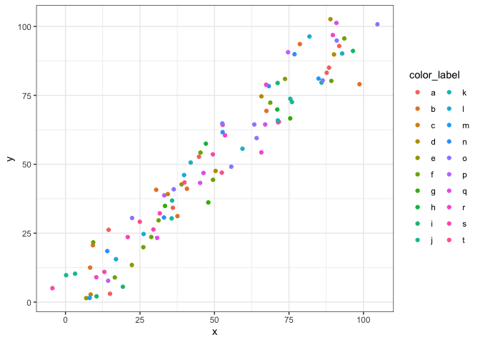
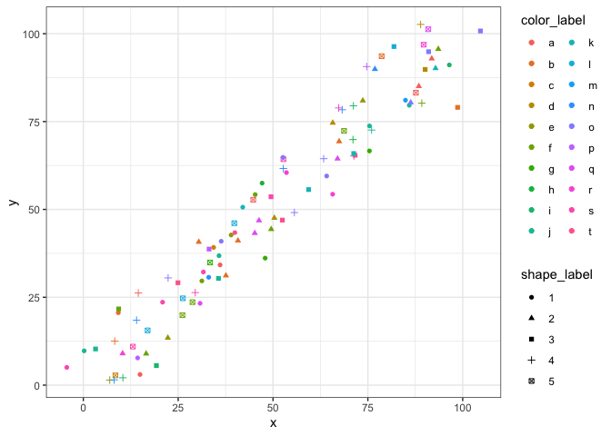
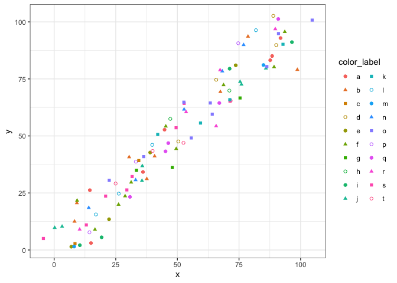
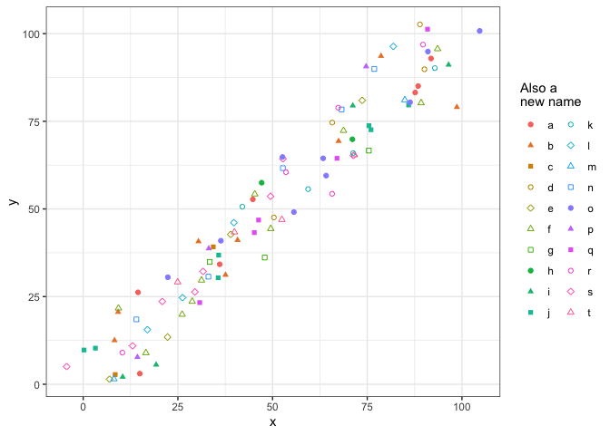

# ggunileg

I often face the problem of wanting to visually distinguish data with
dozens of distinct groups, in which case color scales often become
uninformative.

``` r
library(ggplot2)
some_data <- data.frame(x = 1:100 + runif(n = 100, min = -10, max = 10), y = 1:100 + runif(n = 100, min = -10, max = 10), color_label = sample(letters[1:20], size = 100, replace = T))
bad_plot <- ggplot(data = some_data, aes(x = x, y = y, color = color_label)) +
  geom_point() +
  theme_bw() +
  guides(color = guide_legend(ncol = 2))
bad_plot
```

<!-- -->

One potential solution is to combine color- and shape scales, but this
is not really helpful out of the because the legends are not combined by
default, so mapping invidiual points to their color- and shape value by
eye is cumbersome at best.

``` r
some_data$shape_label <- as.factor(sample(1:5, size = dim(some_data)[1], replace = TRUE))
still_bad_plot <- ggplot(data = some_data, aes(x = x, y = y, color = color_label, shape = shape_label)) +
  geom_point() +
  theme_bw() +
  guides(color = guide_legend(ncol = 2))
still_bad_plot
```

<!-- -->

To fix this I offer the `scale_color_highres` function as a convenience
function. Note how the `shape_label` does not get used here, instead the
initial `color_label` variable is mapped to both color and shape
aesthetics here.

``` r
library(ggunileg)
# No need to for this.
some_data$shape_label <- NULL
useful_plot <- ggplot(data = some_data, aes(x = x, y = y, color = color_label, shape = color_label)) +
  geom_point() +
  theme_bw() +
  scale_color_highres() +
  guides(color = guide_legend(ncol = 2), shape = guide_legend(ncol = 2))
useful_plot
```

<!-- -->

The number of distinct shape levels can be controlled using the
`num_shape_levels` parameter which expects an intenger. In this case,
shapes default to (in my opinion) nice-looking shapes.

``` r
library(ggunileg)
useful_plot <- ggplot(data = some_data, aes(x = x, y = y, color = color_label, shape = color_label)) +
  geom_point() +
  theme_bw() +
  scale_color_highres(num_shape_level = 7, name = 'Also a\nnew name') +
  guides(color = guide_legend(ncol = 2), shape = guide_legend(ncol = 2))
useful_plot
```

<!-- -->

Alternatively you can control the shapes itself with the `shape_values`
which gets repeated for each .

``` r
library(ggunileg)
useful_plot <- ggplot(data = some_data, aes(x = x, y = y, color = color_label, shape = color_label)) +
  geom_point() +
  theme_bw() +
  scale_color_highres(shape_values = c(18, 3, 5, 7), name = 'Also a\nnew name') +
  guides(color = guide_legend(ncol = 2), shape = guide_legend(ncol = 2))
useful_plot
```

<!-- -->

# Installation

To install, run `devtools::install_github('karchern/ggunileg')`. If you
don’t have devtools installed, run `install.packages('devtools')` first.
